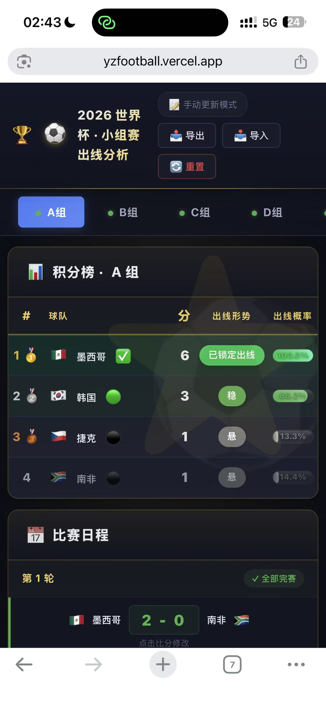
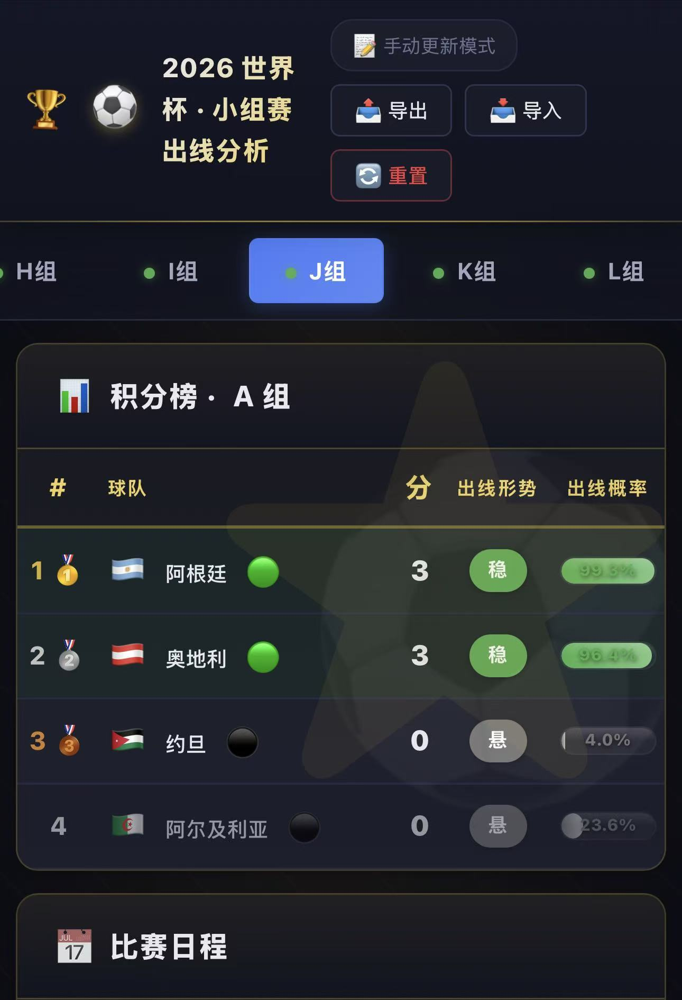
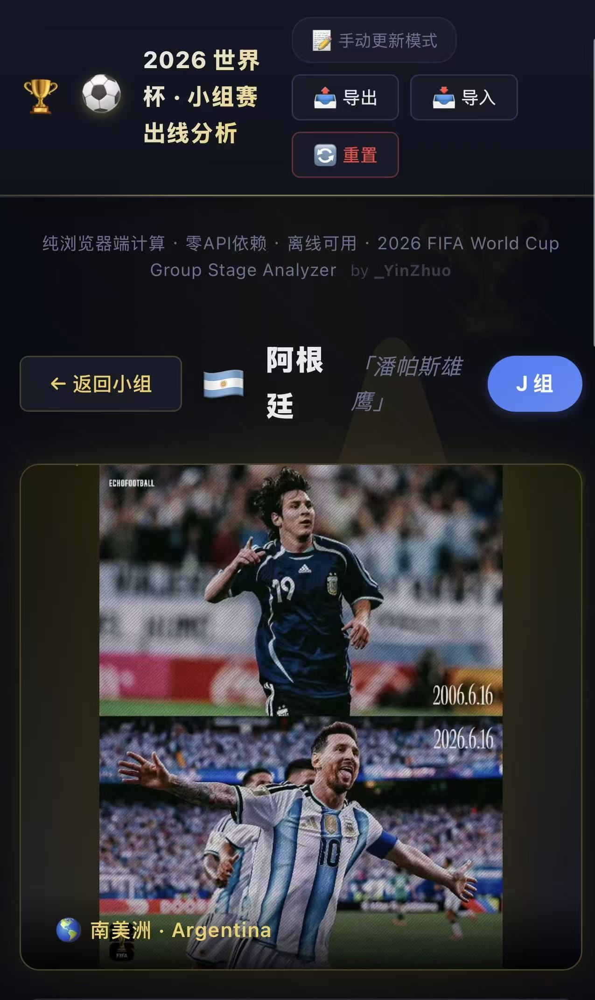
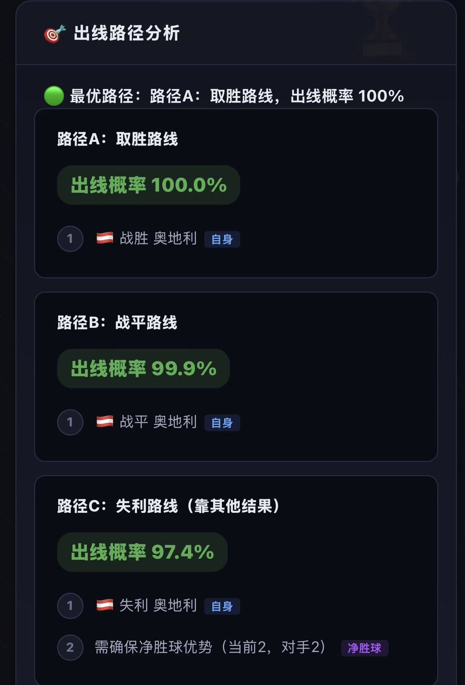
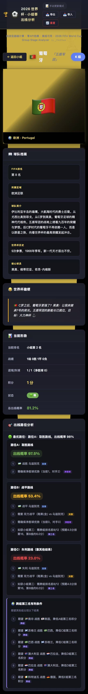

<p align="center">
  
</p>

<h1 align="center">⚽ 2026 FIFA World Cup · Group Stage Analyzer</h1>

<p align="center">
  <b>Pure Browser-Side Computation · Zero Dependencies · Offline Ready · Open Source</b>
</p>

> <br>
> **"Twelve groups battle. Eight spots remain. Beyond the pitch, mathematics holds the answer."**<br>
> <br>
> For the first time in history, the FIFA World Cup expands to 48 teams. Under the new format,<br>
> only the **top 8 out of 12 third-place finishers** advance to the knockout stage.<br>
> A team's fate is no longer decided solely within its own group —<br>
> it depends on results from across all twelve groups.<br>
> <br>
> Traditional intuition fails against this unprecedented complexity.<br>
> So we turned to mathematics — enumerating every possible future,<br>
> calculating the hidden path to qualification behind every probability.<br>
> <br>
> *— A football lover & computation geek, built for this one-of-a-kind World Cup.* ⚽

<p align="center">
  <a href="https://yzfootball.vercel.app"></a>
  <a href="https://gitee.com/guo-yinzhuo/worldcup-oracle"></a>
  <a href="LICENSE"></a>
  <a href="https://github.com/guo-yinzhuo/worldcup-oracle/stargazers"></a>
</p>

<p align="center">
  
  
  
  
  
</p>

<p align="center">
  <a href="https://yzfootball.vercel.app"><b>🌐 Live Demo</b></a> ·
  <a href="#-features"><b>✨ Features</b></a> ·
  <a href="#-quick-start"><b>🚀 Quick Start</b></a> ·
  <a href="#-architecture"><b>🧠 Architecture</b></a> ·
  <a href="#-contributing"><b>🤝 Contributing</b></a>
</p>

<p align="center">
  <sub>📖 <a href="README_CN.md">中文文档</a> also available</sub>
</p>

---

## 📸 Screenshots

| Group A Standings | Group J (Argentina) |
|:---:|:---:|
|  |  |

| Argentina Team Page | Argentina Qualification Paths |
|:---:|:---:|
|  |  |

| Brazil Qualification Paths (Complex Case) |
|:---:|
|  |

---

## ✨ Features

### Core

| Feature | Description |
|---------|-------------|
| 📊 **Live Standings** | 12 groups × 4 teams. P/W/D/L/GF/GA/GD/Pts. Full FIFA rules compliance |
| 🔮 **Smart Predictions** | FIFA-ranking-weighted exhaustive enumeration + Monte Carlo sampling |
| 🔍 **Team Detail Page** | Click any team → profile, history, star players, World Cup memes |
| 🌍 **Cross-Group Analysis** | 12 third-place teams ranked in real-time. Specific conditions like "Team X must lose to Team Y" |
| 🎨 **Color Status System** | 🥇Locked 1st / ✅Locked / 🟢Safe / 🟡Hopeful / ⚫Slim / 💀Eliminated |
| 😂 **Football Memes** | 48 unique memes — Kane's trophy curse, Vini Jr.'s "little bear", Haaland the monster... |
| 💾 **Data Persistence** | localStorage auto-save + JSON import/export |
| 📱 **Responsive** | 320px–1920px, mobile/tablet/desktop |

### Keyboard Shortcuts

| Key | Action | Key | Action |
|-----|--------|-----|--------|
| `←` `→` | Switch group | `Esc` | Close modal |
| `A`–`L` | Jump to group | `R` | Recalculate |

---

## 🚀 Quick Start

### Online (Recommended)
Visit **[yzfootball.vercel.app](https://yzfootball.vercel.app)** — no installation needed.

### Local
```bash
git clone https://github.com/guo-yinzhuo/worldcup-oracle.git
# Double-click index.html — or:
npx serve .
```

### One-Click Deploy

<p align="center">
  <a href="https://vercel.com/new/clone?repository-url=https://github.com/guo-yinzhuo/worldcup-oracle">
    
  </a>
  &nbsp;
  <a href="https://app.netlify.com/start/deploy?repository=https://github.com/guo-yinzhuo/worldcup-oracle">
    
  </a>
</p>

---

## 🧠 Architecture

### Data Flow

```
User inputs score → Enumeration engine starts
  ├── Played matches: actual scores
  ├── Unplayed matches: weighted enumeration or Monte Carlo
  │    └── FIFA-ranking-weighted goal probability distribution
  ├── FIFA rules ranking → tally qualification scenarios
  └── Cross-group 3rd place comparison → probability → color → UI update
```

### Weighted Probability Model (v2.0 Core Innovation)

Traditional enumeration assumes all scorelines are equally likely. v2.0 introduces a **FIFA-ranking-based exponential weighting model**:

- Ranking → strength score → goal probability distribution shift
- Uses `ratio^1.8` exponential weighting
- Strong teams' goal distribution shifts right; weak teams' shifts left

| Matchup | Equal Model | Weighted Model |
|---------|:---:|:---:|
| 🇪🇸 Spain vs 🇸🇦 Saudi Arabia | 33% | **64%** |
| 🇪🇸 Spain vs 🇺🇾 Uruguay | 33% | **39%** (close) |
| 🇸🇦 Saudi Arabia vs 🇨🇻 Cape Verde | 33% | **57%** |
| 🇺🇾 Uruguay vs 🇨🇻 Cape Verde | 33% | **78%** |

### Enumeration Strategy

| Remaining | Method | Scenarios | Time |
|-----------|--------|-----------|------|
| 0–1 | Direct | 1 | instant |
| 2–4 | Full (weighted) | 625–390K | <5ms |
| 5 | Full | ~9.7M | ~5ms |
| 6 | Monte Carlo | 100K | ~50ms |

---

## 📁 Project Structure

```
worldcup-oracle/
├── index.html              ← SPA entry + team detail page
├── css/style.css           ← World Cup gold-dark theme (~1200 lines)
├── js/
│   ├── data.js             ← 48 team profiles + 72 fixtures + memes
│   ├── engine.js           ← Weighted enumeration engine + qualification paths
│   ├── api.js              ← Live score API client (manual mode)
│   ├── rules.js            ← FIFA official ranking rules (7-level tiebreak)
│   ├── colorSystem.js      ← Probability → color mapping
│   ├── renderer.js         ← All DOM rendering
│   └── main.js             ← Controller + routing + state
├── data/                   ← JSON data (server deployment)
├── img/teams/              ← Team hero photos (48× .jpg)
├── screenshots/            ← UI screenshots
├── .github/                ← CI/CD + issue templates
├── LICENSE                 ← MIT
├── CONTRIBUTING.md         ← Contribution guide
├── CODE_OF_CONDUCT.md      ← Community standards
├── SECURITY.md             ← Security policy
├── README.md               ← You are here
└── README_CN.md            ← 中文文档
```

---

## 🛠️ Tech Stack

| Layer | Technology |
|-------|-----------|
| Frontend | Vanilla JavaScript (ES6+) |
| Styling | CSS3 + Grid + Flexbox |
| Data | JSON + localStorage |
| Algorithms | Cartesian product enumeration + Monte Carlo sampling |
| Math Model | FIFA-ranking exponential weighting (ratio^1.8) |
| Rules Engine | FIFA 7-level tie-breaking |
| Deployment | Vercel + Gitee Pages |
| Dev Tools | Claude Code (AI-assisted development) |

---

## 🧗 Challenges & Solutions

### 1. The Equal-Probability Fallacy
**Problem:** Initial engine treated all unplayed scorelines as equally likely — Spain 4:0 Cape Verde had the same probability as Cape Verde 4:0 Spain.

**Solution:** Designed a FIFA-ranking-based exponential weighting model. Rankings → strength scores → goal probability shifts. `ratio^1.8` chosen after tuning for optimal balance between realism and upset potential (~15-20%).

### 2. Cross-Group Third-Place Complexity
**Problem:** 12 third-place teams competing for 8 spots can't be analyzed with simple point thresholds.

**Solution:** Simultaneous multi-group Monte Carlo simulation tracking third-place point distributions. Generates specific conditions like "Team X beating Team Y helps this team qualify."

### 3. Production Data Corruption
**Problem:** Standings broke after deploying to Vercel. Root cause: (a) API-fetched data had different fixture ordering than embedded schedule; (b) localStorage v2 cache used old match IDs.

**Solution:** Removed auto-fetch API entirely (manual-update-only mode). Upgraded localStorage key to v3, auto-invalidating stale cache. Embedded data now single source of truth.

### 4. Pure-Frontend Performance
**Problem:** 25^6 ≈ 244M combinations when all 6 matches are unplayed.

**Solution:** Hybrid strategy — full enumeration for ≤5 remaining (≤5ms), Monte Carlo sampling (100K, ~50ms, ±1.5% error) for 6 remaining. Lazy computation: only current group is calculated.

---

## 🤝 Contributing

Contributions are welcome! See [CONTRIBUTING.md](./CONTRIBUTING.md) for details.

### Ways to Contribute
- 🐛 Report bugs → [Bug Report](.github/ISSUE_TEMPLATE/bug_report.md)
- 💡 Suggest features → [Feature Request](.github/ISSUE_TEMPLATE/feature_request.md)
- 🔧 Submit code → Fork → PR
- 📸 Team photos → Place in `img/teams/` (format: `{3-letter-ID}.jpg`)

---

## 📝 Changelog

| Version | Date | Highlights |
|---------|------|-----------|
| v2.1 | 2026-06-21 | GitHub community docs, English README, CI/CD |
| v2.0 | 2026-06-20 | Weighted probability model, team detail pages, meme system |
| v1.0 | 2026-06-19 | Core enumeration engine, standings, color system |

---

## ⭐ Star History

<p align="center">
  <a href="https://star-history.com/#guo-yinzhuo/worldcup-oracle&Date">
    
  </a>
</p>

---

<p align="center">
  <sub>Made with ❤️ by <a href="https://github.com/guo-yinzhuo"><b>_YinZhuo</b></a></sub>
  <br>
  <sub>2026 FIFA World Cup Group Stage Analyzer · MIT License</sub>
</p>
